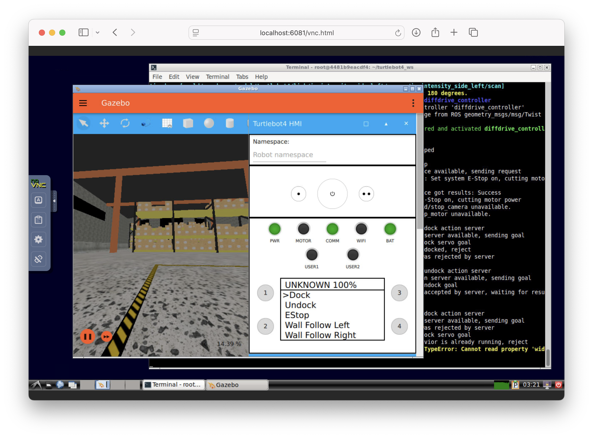

# TurtleBot 4 Simulator in Docker 

This Docker setup provides a ready-to-use environment for simulating the TurtleBot 4 using ROS 2 Humble and Ignition Fortress.

## 🚀 Features

- Ubuntu 22.04 
- ROS 2 Humble
- TurtleBot 4 Simulator (Ignition-based)
- A full LXDE desktop inside a Docker container
- GUI access via browser at [http://localhost:6080](http://localhost:6080)
- Working noVNC + VNC display stack


## 🔧 Build the Docker Image

```bash
docker build -t turtlebot4_sim .
```

## ▶️ Run the Simulator with GUI (VNC)

```bash
docker run -it --rm -p 5900:5900 -p 6080:6080 --name turtlebot4 turtlebot4_sim
```

Then open your browser to:

- `http://localhost:6080` (web-based VNC viewer)
- or connect with a VNC client to `localhost:5901` (password: `vncpassword`)

You’ll see a full Linux desktop running inside your browser, with the TurtleBot 4 Ignition simulator starting automatically.

## 🧠 What's Inside

The container:

- Ubuntu 22.04 base image
- Full ROS 2 Humble desktop setup
- TurtleBot 4 packages cloned and built from source
- Ignition Fortress physics engine
- LXDE desktop, X11, x11vnc, and noVNC for GUI display
- Automatically launches the simulator in a virtual display

## 🖼️ Final Result

Below is a screenshot of the TurtleBot 4 Simulator running in a virtualized GUI via VNC:


