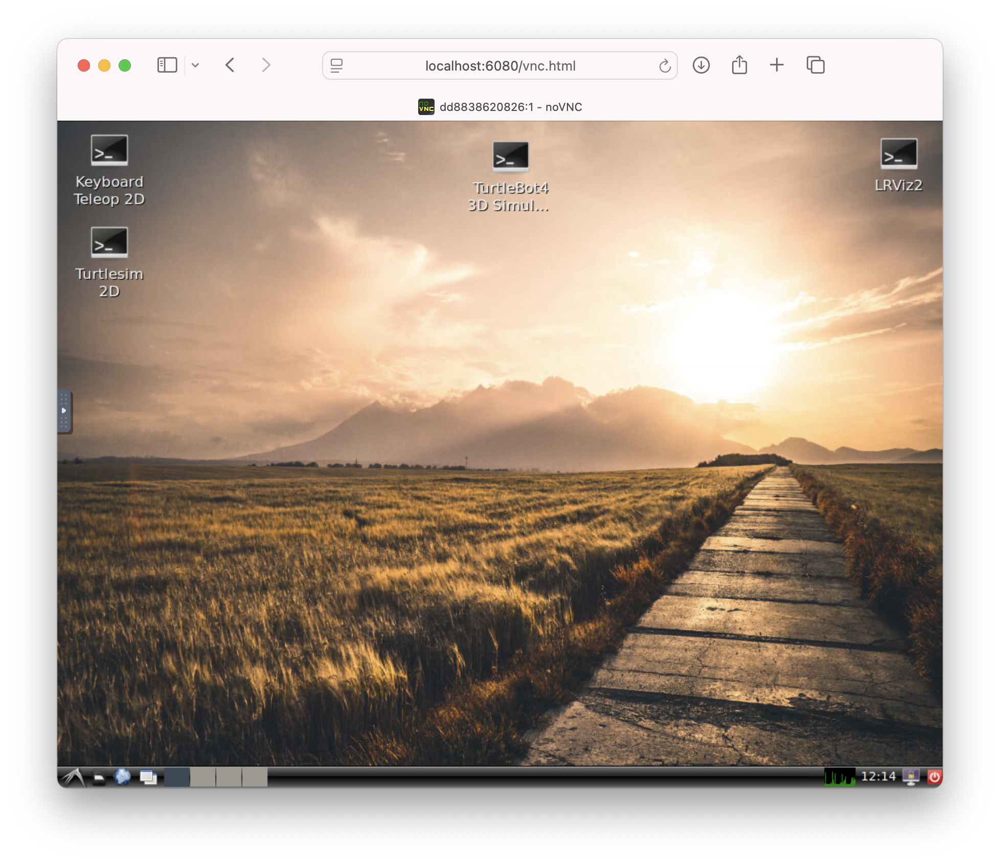

# TurtleBot 4 Simulator in Docker

This Docker setup provides a full-featured environment for simulating the TurtleBot 4 using ROS 2 Humble and Ignition Fortress.


## 🚀 Features

* Ubuntu 22.04
* ROS 2 Humble (Desktop + Dev tools)
* TurtleBot 4 Simulator (Ignition Fortress-based)
* Turtlesim 2D simulator
* LXDE graphical desktop inside Docker
* GUI access via browser (noVNC) or VNC client
* Desktop shortcuts for launching:
  * TurtleBot4 3D Simulator
  * Turtlesim 2D
  * Keyboard Teleoperation
* Open terminal access to run custom `ros2` commands


## 🔧 Build the Docker Image

```bash
docker build --no-cache -t turtlebot4_sim .
```


## ▶️ Run the Simulator with GUI (noVNC)

```bash
docker run -it --rm \
  -p 5900:5900 -p 6080:6080 \
  --name turtlebot4 \
  turtlebot4_sim
```


## Access the Desktop

* Open in browser: [http://localhost:6080](http://localhost:6080)
* Or connect with a VNC client:

  * Host: `localhost`
  * Port: `5900`
  * Password: `vncpassword`

You will see a full Ubuntu LXDE desktop inside your browser or VNC viewer.


## 🧠 What You Can Do Inside the Desktop

* Click **Start TurtleBot4 3D Simulation** to launch the Ignition simulation in a maze world.
* Click **Start Turtlesim 2D** to launch the classic turtlesim node.
* Click **Keyboard Teleop** to control a robot using your keyboard.
* Open the **LXTerminal** and run any ROS 2 command (e.g., `ros2 topic list`).


## 🖼️ Result

* You get an interactive full desktop environment running in your browser, preloaded with all necessary tools to simulate, visualize, and control the TurtleBot 4 in both 2D and 3D worlds.

* Need to connect a real robot? No problem. Just map USB devices or use `--network host` and set up your ROS\_DOMAIN\_ID accordingly.

* You're in full control of ROS 2.


## 🖼️ Screenshot

Here’s what the virtual desktop looks like with the TurtleBot 4 simulator:



> _Replace `docs/screenshot.png` with your actual image path in your repo._

